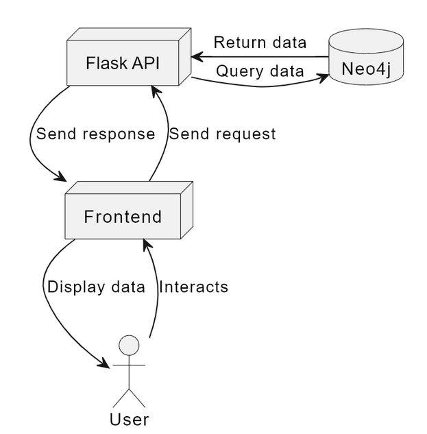
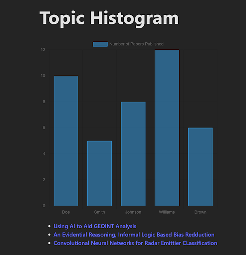

# Capstone Team 07 - Riverside Research

## The Project

This Capstone project is a standalone data visualization and analytical tool that utilizes the same technologies as Riverside Research's LiMA application, including React/Typescript, Flask, and Neo4j. The primary objective is to create a seamless integration pathway by ensuring compatibility with LiMA's existing infrastructure. Our tool empowers users to extract insights from metadata sourced from technical documents like papers and articles. With features such as histograms for temporal trend analysis, pie charts for category distribution visualization, and knowledge graphs revealing connections between authors, organizations, and topics, our project serves as a vital stepping stone toward enhancing LiMA's functionality. Through this endeavor, we aim to facilitate a smooth transition by ensuring that the developed code can be seamlessly integrated into the LiMA platform, thereby optimizing research capabilities for users.

> Insert deployed project here 

## The Team

**[Bryce Conley](mailto:conleyb2@udayton.edu)**

Major: CIS  |  Minor: Cyber Security Mgmt

**[Bobby Wilkens](mailto:wilkensb1@udayton.edu)**

Major: CIS  |  Minor: Cyber Security Mgmt

**[Andrew Boerger](mailto:boergera2@udayton.edu)**

Major: CIS  |  Minor: Music Technology

## Sponsor

**Sphere of Operation**: [Riverside Research](https://www.riversideresearch.org/)

**Specific contact**: *Todd Irlbeck*, Software Applications Team Lead- Intelligence and Defense Solutions

## Design Overview

## Monthly Progress

### Month 1: Familiarity

The first month had a focus of getting the team familiar with everything that we were working with for the project. This included three primary tasks:

1. Researching the technologies that are being used in the project:

    - [React/TypeScript](https://docs.google.com/document/d/1QRyA2zaTRjBmIsNzNtPSbNQ13_3oczqZeWKlv2cT9ms/edit)

    - [Flask](https://docs.google.com/document/d/19aO4xIXEr8QtiqUwTCRhQJlue-r1oEKEpeQCgSrn0Lc/edit)

    - [Neo4j]()

    - [Data Visualization](https://docs.google.com/document/d/1WznjjzQvBE7lzuG4anxtJWIw8QdM1KXSFs72ObEOHJw/edit)

2. Familiarize ourselves with the sample data in use, which includes:

    - Types of papers (Abstract, Article, Book, Conference, Conference Proceedings, Dissertation, Journal Article, Magazine Article, Master Thesis, Media, Other, Other Publication, Patent, PowerPoint, Thesis, Website )

    - Information contained in the papers (Title, Authors, Organizations Involved, Research Areas, Publish Date)

    - Determining what can be derived from this information (ex. Does a spike in yearly publications on a topic indicate some trend?)

3. Setting up base infrastructure for the project:

    - Set up All three layers of the project

        - Vite used to create boilerplate for the React/TypeScript frontend

        - A very basic Flask API implementation was creted

        - Shared account created for Neo4j to bypass the need for a paid plan that would be required to share database access between multiple accounts.

    - Connect all three layers:

        - Frontend makes calls to the routes created to the Flask API

        - Neo4j is connected to the Flask API with the GraphDatabase Driver from Neo4j

    - Create our first Histogram to familiarize ourselves with how to go about using Chart.js

    

## Month 2: Functionality

Month 2 of the project was where the focus turned to functionlaity of the project. This included:

1. A selector for choosing the topic to be displayed within the charts

2. Additional charts:

    - Papers per year line chart

    - Distribution of topics for an author histogram

3. Author search bar with suggestions

4. Ability to save charts

5. A table displaying information (title, publication date, organizations, research areas, authors) for all of the papers in the selected topics.

6. Anility to filter papers based on what is selected from charts

### State of the project
#### Basic Visualization Features
[Basic_Visualization](./videos/Demo%201.mkv)
#### Advanced Featuers
[Advanced_Features](./videos/Demo%202.mkv)
#### Add Project Form
[Add_Project_Form](./videos/Demo%203.mkv)
#### CSV  Reader
[CSV_Reader](./videos/Demo%204.mp4)