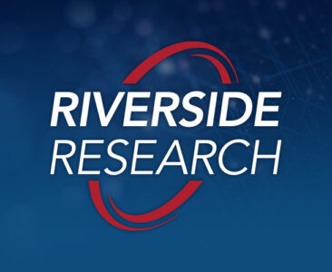

# Capstone Team 07 - Riverside Research

## The Project

> Insert deployed project here 

#### Project Overview

This Capstone project focuses on developing data visualization and analytical tools to assist users in deriving knowledge from metadata. Riverside Research’s Literature and Management Analysis (LiMA) application assists users with capturing metadata from technical documents (e.g., technical papers, conference papers, journal articles, etc.) that they then use as part of their research into emerging technologies and global trends. Users desire tools that enable them to analyze the metadata they have collected to assist them with their research. Examples include histograms to visualize temporal trends in publishing, pie charts to visualize the percentage of publications on a category or subcategory, and/or knowledge graphs to show connections between authors, organizations, and topics.

## The Team

**Bryce Conley**

Major: CIS  |  Minor: Cyber Security Mgmt

**Bobby Wilkens**

Major: CIS  |  Minor: Cyber Security Mgmt

**Andrew Boerger**

Major: CIS  |  Minor: Music Technology

### Sponsor

**Sphere of Operation**: [Riverside Research](https://www.riversideresearch.org/)

**Specific contact**: *Todd Irlbeck*, Software Applications Team Lead- Intelligence and Defense Solutions

### Design Overview

